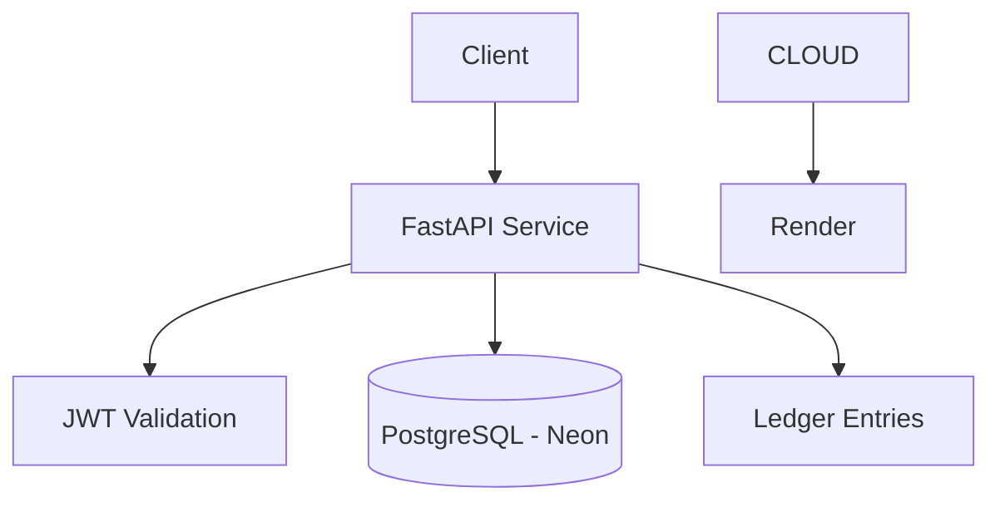

# SuperCool Balances Service
REST microservice for account and balance management, built with FastAPI, SQLAlchemy, and JWT authentication, supporting account creation, balance inquiries, deposits, withdrawals, and movement audit tracking.

---

## 🚀 Features

* Create and manage accounts
* Deposit and withdraw funds
* Idempotent operations to prevent duplicate transactions
* Ledger-based audit system
* JWT-based authentication (basic)

---

## 🏗️ Architecture



---

## 📁 Project Structure

```
super_cool_finances/
├── main.py
├── database.py
│
├── core/
│   ├── __init__.py
│   ├── security.py       ← autenticación, JWT, bcrypt
│   └── validators.py     ← get_account_or_404, validate_withdraw
│
├── db/
│   ├── __init__.py
│   └── models.py         ← modelos SQLAlchemy
│
├── schemas/
│   ├── __init__.py
│   └── schemas.py        ← schemas Pydantic
│
├── routers/
│   ├── accounts.py
│   ├── audit.py
│   ├── auth.py
│   └── movements.py
│
└── tests/
    └── test_api.py
```

---

## ⚙️ Tech Stack

* Python (FastAPI)
* SQLAlchemy
* PostgreSQL (Neon)
* Render (deployment)

---

## 🔐 Security

* JWT authentication
* Input validation with Pydantic
* Idempotency keys for safe retries
* Database constraints (e.g. balance >= 0)
* Row-level locking using `SELECT FOR UPDATE`

---

## 🧪 Running Locally

### 1. Clone repository

```bash
git clone <your-repo-url>
cd <your-project>
```

### 2. Set environment variables

```bash
export DATABASE_URL=<your-neon-connection>
export JWT_SECRET=<your-secret>
```

### 3. Run the service

```bash
uvicorn main:app --reload
```

### 4. Open API docs

```
http://localhost:8000/docs
```

---

## 🔌 API Endpoints

### Health

**GET /health**
```bash
curl http://localhost:8000/health
```
```json
{ "status": "ok" }
```

---

### Auth

**POST /auth/login**
```bash
curl -X POST http://localhost:8000/auth/login \
  -H "Content-Type: application/json" \
  -d '{"username": "alice", "password": "alice123"}'
```
```json
{
  "access_token": "<jwt_access>",
  "refresh_token": "<jwt_refresh>",
  "token_type": "bearer"
}
```

**POST /auth/refresh**
```bash
curl -X POST http://localhost:8000/auth/refresh \
  -H "Content-Type: application/json" \
  -d '{"refresh_token": "<jwt_refresh>"}'
```
```json
{
  "access_token": "<new_jwt_access>",
  "refresh_token": "<new_jwt_refresh>",
  "token_type": "bearer"
}
```

---

### Accounts

**POST /accounts**
```bash
curl -X POST http://localhost:8000/accounts \
  -H "Content-Type: application/json" \
  -H "Authorization: Bearer <jwt_access>" \
  -d '{"owner": "Alice"}'
```
```json
{
  "id": 1,
  "owner": "Alice",
  "balance": 0.00,
  "created_at": "2026-04-22T10:00:00"
}
```

**GET /accounts/{account_uuid}/balance**
```bash
curl http://localhost:8000/accounts/a1b2c3d4-.../balance \
  -H "Authorization: Bearer <jwt_access>"
```
```json
{
  "account_uuid": "a1b2c3d4-...",
  "balance": 100.00
}
```

---

### Movements

**POST /accounts/{account_uuid}/deposit**
```bash
curl -X POST http://localhost:8000/accounts/a1b2c3d4-.../deposit \
  -H "Content-Type: application/json" \
  -H "Authorization: Bearer <jwt_access>" \
  -H "idempotency-key: unique-key-001" \
  -d '{"amount": 50.00, "description": "Initial deposit"}'
```
```json
{
  "id": 1,
  "account_uuid": "a1b2c3d4-...",
  "ttk_tracking_id": "unique-key-001",
  "disposable": 150.00,
  "type_tx": "FUND",
  "amount_tx": 50.00,
  "cdate": "2026-04-22T10:05:00",
  "status_tx": "fund",
  "description": "Initial deposit"
}
```

**POST /accounts/{account_uuid}/withdraw**
```bash
curl -X POST http://localhost:8000/accounts/a1b2c3d4-.../withdraw \
  -H "Content-Type: application/json" \
  -H "Authorization: Bearer <jwt_access>" \
  -H "idempotency-key: unique-key-002" \
  -d '{"amount": 20.00, "description": "ATM withdrawal"}'
```
```json
{
  "id": 2,
  "account_uuid": "a1b2c3d4-...",
  "ttk_tracking_id": "unique-key-002",
  "disposable": 130.00,
  "type_tx": "CHARGE",
  "amount_tx": 20.00,
  "cdate": "2026-04-22T10:10:00",
  "status_tx": "settled",
  "description": "ATM withdrawal"
}
```

---

### Audit

**GET /accounts/{account_id}/ledger**
```bash
curl http://localhost:8000/accounts/1/ledger \
  -H "Authorization: Bearer <jwt_access>"
```
```json
[
  {
    "id": 1,
    "account_uuid": "a1b2c3d4-...",
    "ttk_tracking_id": "unique-key-001",
    "disposable": 150.00,
    "type_tx": "FUND",
    "amount_tx": 50.00,
    "cdate": "2026-04-22T10:05:00",
    "status_tx": "fund",
    "description": "Initial deposit"
  },
  {
    "id": 2,
    "account_uuid": "a1b2c3d4-...",
    "ttk_tracking_id": "unique-key-002",
    "disposable": 130.00,
    "type_tx": "CHARGE",
    "amount_tx": 20.00,
    "cdate": "2026-04-22T10:10:00",
    "status_tx": "settled",
    "description": "ATM withdrawal"
  }
]
```

---

## ☁️ Deployment

This service is designed to be deployed as a cloud-native application:

* API hosted on Render
* PostgreSQL hosted on Neon
* Environment variables used for secrets
* HTTPS handled by platform

---

## 🧠 Design Notes

* Transactions ensure atomic operations
* Row-level locking prevents race conditions
* Ledger model enables auditability
* Idempotency avoids duplicate operations

---

## 🧪 Tests

Run tests with:

```bash
pytest
```

---

## 🤖 AI Usage

AI tools were used to assist with:

* GitHub Copilot

All code was reviewed and adapted manually.

---

## 📌 Notes

This project is a technical demonstration focused on correctness, clarity and safe financial operations rather than production readiness.

For technical test purposes, database credentials are intentionally kept in the environment configuration to simplify setup and reviewer validation. In a real production environment, these credentials must be rotated and managed with a secure secrets manager.


